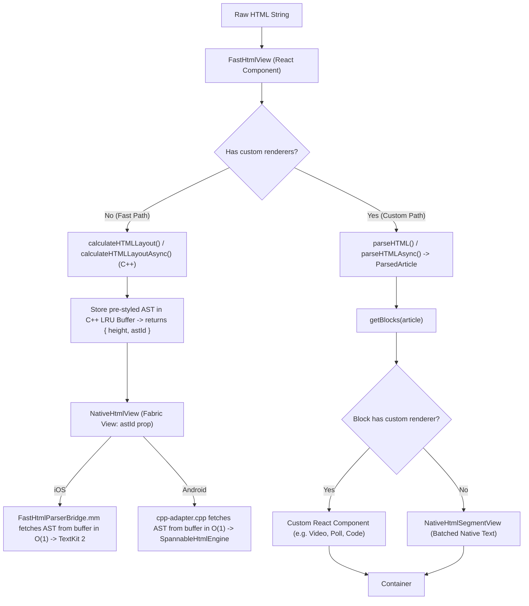
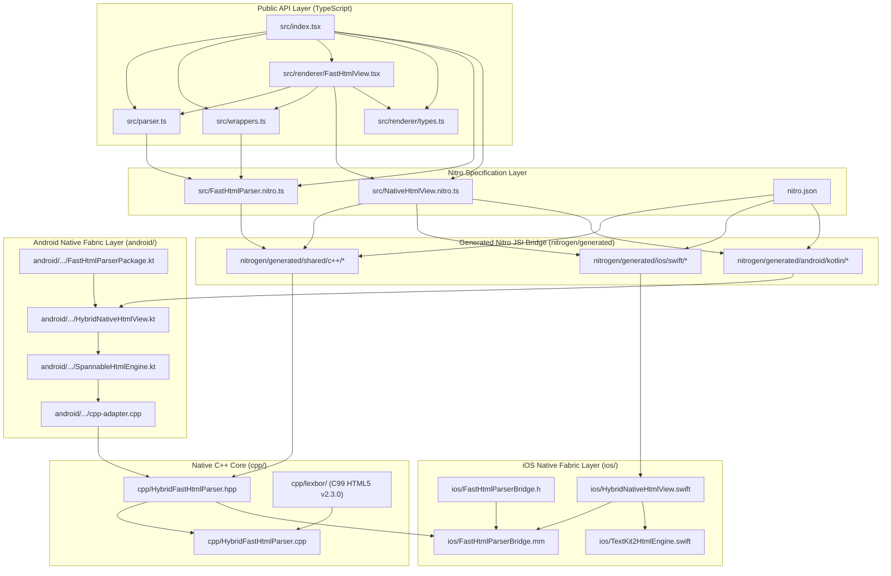
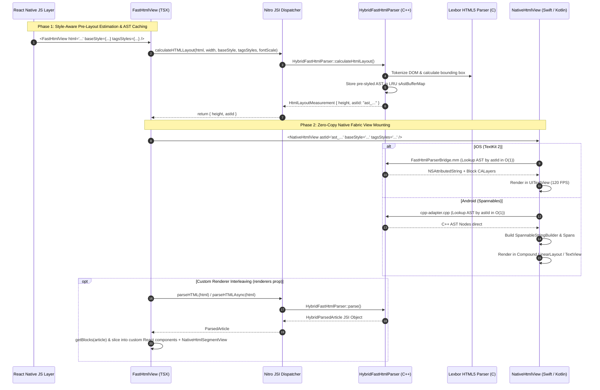

# Codebase Understanding Report: `react-native-nitro-html`

## 1. Project Overview & Architecture

`react-native-nitro-html` is an ultra-high performance HTML parser and 100% native Fabric RichText rendering engine for React Native (iOS & Android).

### Core Highlights:
- **Compiled C++ Parser (Lexbor HTML5 v2.3.0)**: Parses raw HTML directly into a typed C++ Abstract Syntax Tree (AST) using the industrial-grade `lexbor` C library.
- **Direct JSI HostObjects (via Nitro Modules)**: Exposes the parsed AST directly to JavaScript as zero-copy JSI host objects (`HybridParsedArticle`, `HybridContentBlock`, `HybridInlineNode`, etc.) with lazy JSI traversal.
- **Style-Aware C++ Layout Engine & Memory Buffer Cache**:
  - `calculateHTMLLayout()` / `calculateHTMLLayoutAsync()` computes exact bounding boxes for Frame 0 before mounting, preventing Cumulative Layout Shift (CLS).
  - Pre-tokenized and pre-styled AST is stored in an $O(1)$ thread-safe LRU memory cache (`sAstBufferMap`, capacity 128) indexed by a deterministic 64-bit FNV-1a hash token (`astId`, e.g., `"ast_6f41b2..."`).
- **Zero-Copy Native Fabric Rendering**:
  - Native views (`NativeHtmlView` on iOS & Android) receive the lightweight `astId` token prop, fetching the pre-styled C++ AST directly from memory in $O(1)$ without UI-thread parsing or JSON serialization.
  - **iOS**: Apple TextKit 2 (`FastHtmlParserBridge.mm`, `NSTextLayoutManager`, `NSTextContentStorage`, `UITextView`).
  - **Android**: Precomputed Android Spannables (`cpp-adapter.cpp`, `SpannableHtmlEngine.kt`, `SpannableStringBuilder`, `MetricAffectingSpan`).
- **Dual-Path Rendering Engine**:
  1. **Fast Path (Default, 100% Native Fabric Layer)**: Renders the entire HTML document in a single native view with 0 React Virtual DOM allocations at 120 FPS.
  2. **Custom Renderer Path (`renderers` prop)**: Traverses C++ AST blocks via `getBlocks()`, rendering custom React components for matched block types (e.g. `Video`, `CodeBlock`, `Table`, custom tags) and batching adjacent text into optimized native segment views (`NativeHtmlSegmentView`).
- **Asynchronous Worker Thread Offloading (`mode="async"`)**:
  - Offloads AST parsing and layout math to a thread-safe C++ worker pool via Promises (`calculateHtmlLayoutAsync`), guaranteeing 0ms JS main thread lockup on massive 10,000+ words payloads.
- **3-Tier Cascading Style System**: Enforces standard CSS specificity across C++, Swift, and Kotlin:
  - **Tier 1 (Base Style)**: Document-wide typography defaults via `baseStyle` prop.
  - **Tier 2 (Tags Styles)**: Semantic HTML tag overrides via `tagsStyles` prop.
  - **Tier 3 (Inline HTML Styles)**: Element-level `style="..."` attributes parsed directly from HTML.

---

## 2. Tech Stack

| Layer | Technologies & Dependencies |
| :--- | :--- |
| **Core Architecture** | React 19.2.3, React Native 0.85 (Fabric New Architecture), Nitro Modules (`react-native-nitro-modules` v0.37.1) |
| **Language & Tooling** | TypeScript 6, C++20, Swift 5.x, Kotlin (Java 17 / JVM Target), CMake, CocoaPods |
| **C++ Core Engine** | Lexbor HTML5 Parser (`cpp/lexbor` v2.3.0), JNI (`fbjni`), Nitrogen code generator |
| **iOS Engine** | TextKit 2, `NSTextLayoutManager`, `NSTextContentStorage`, `UITextView`, `CoreText`, `CALayer` |
| **Android Engine** | `SpannableStringBuilder`, `MetricAffectingSpan`, `LineBackgroundSpan`, `ReactFontManager` reflection |
| **Build & Packaging** | `react-native-builder-bob`, `turbo`, `yarn` (v4 berry) |
| **Linting & Testing** | Jest 29 (41 unit tests), ESLint 9 (Flat Config with Prettier) |

---

## 3. Folder & File Structure

```
react-native-fast-html-parser/
├── src/                                  # TypeScript Source & Public API
│   ├── index.tsx                         # Primary library export entry point
│   ├── parser.ts                         # Nitro HybridObject wrapper (parseHTML, calculateHTMLLayout, normalizeHTML, AST buffer)
│   ├── wrappers.ts                       # AST traversal helper functions (getBlocks, getChildren, getItems, getRows, etc.)
│   ├── FastHtmlParser.nitro.ts           # Nitro spec for C++ parser, AST blocks & inline nodes
│   ├── NativeHtmlView.nitro.ts           # Nitro spec for Fabric NativeHtmlView component
│   ├── renderer/
│   │   ├── FastHtmlView.tsx              # Main React component with Fast Path & Custom Renderer interleaving
│   │   └── types.ts                      # Props & component type definitions
│   └── __tests__/
│       └── index.test.tsx                # Comprehensive Jest test suite (41 tests passing)
├── cpp/                                  # C++ Engine & Parser Implementation
│   ├── HybridFastHtmlParser.hpp          # C++ header for HybridFastHtmlParser & AST node classes
│   ├── HybridFastHtmlParser.cpp          # Lexbor HTML parser, CSS style resolver, layout estimator, AST buffer cache
│   └── lexbor/                           # Vendored Lexbor HTML5 library (C99 v2.3.0)
├── ios/                                  # iOS Native Fabric & TextKit 2 Engine
│   ├── FastHtmlParserBridge.h/.mm        # Obj-C++/C++ bridge: AST memory buffer -> NSAttributedString conversion
│   ├── HybridNativeHtmlView.swift        # Nitro Fabric UIView implementation (UITextView + TextKit 2)
│   └── TextKit2HtmlEngine.swift          # TextKit 2 attributed string builder
├── android/                              # Android Native Engine & JNI Bridge
│   ├── CMakeLists.txt                    # CMake build configuration linking Lexbor & fbjni
│   └── src/main/
│       ├── cpp/cpp-adapter.cpp           # JNI bindings: AST memory buffer -> Android Spannable bridge
│       └── java/.../fasthtmlparser/
│           ├── FastHtmlParserPackage.kt  # React Native package registering NativeHtmlView
│           ├── HybridNativeHtmlView.kt   # Nitro Fabric View implementation (Compound Layout / TextView)
│           └── SpannableHtmlEngine.kt    # Android SpannableStringBuilder engine & custom Spans
├── nitrogen/                             # Auto-generated Nitrogen JSI bindings & specs
│   └── generated/                        # Autolinked bridging code for C++, Swift, and Kotlin
├── example/                              # Showcase & Performance Benchmark App
│   └── src/App.tsx                       # Full interactive demo with 8 tabs (All Blocks, Typography, Scale, Wrappers, JSON)
├── nitro.json                            # Nitro Module configuration
├── package.json                          # Package scripts, dependencies, build targets
└── tsconfig.json                         # TypeScript configuration
```

---

## 4. Architecture & Data Flow



### Key Execution Lifecycle:
1. **Style-Aware Layout Calculation**: `calculateHTMLLayout` (or `calculateHTMLLayoutAsync` when `mode="async"`) evaluates styles and computes bounding box heights in C++ for Frame 0, storing the tokenized AST in `sAstBufferMap`.
2. **Zero-Copy Memory Buffer Access (`astId`)**: Fabric host views receive the deterministic `astId` token, retrieving the pre-styled C++ AST in $O(1)$ without repeating parsing or JSON serialization.
3. **Native TextKit 2 (iOS)**: `FastHtmlParserBridge.mm` converts parsed AST blocks into `NSAttributedString` with custom `CALayer` decorations for block backgrounds, quotes, borders, and image attachments.
4. **Native Spannable Engine (Android)**: `SpannableHtmlEngine.kt` generates Android `SpannableStringBuilder` with custom spans (`BlockBackgroundSpan`, `CustomTypefaceSpan`, `FontFeatureSpan`).
5. **Dynamic Font Resolution**: Dynamically queries bundled/system fonts via `ReactFontManager` (Android) and `UIFontDescriptor` (iOS) with fallbacks for generic CSS families (`monospace`, `serif`, `sans-serif`).

---

## 5. Empirical Benchmarks

### 5.1 Standard Payload Tiers (Native Apple Silicon C++ Core)

| Payload Tier | Exact Size | AST Blocks | Parse Time (ms) | Sustained Throughput |
| :----------- | :--------- | :--------- | :-------------- | :------------------- |
| **1 KB**     | 0.76 KB    | 13 blocks  | **0.0157 ms**   | 47.22 MB/s           |
| **10 KB**    | 9.80 KB    | 175 blocks | **0.0866 ms**   | 110.50 MB/s          |
| **100 KB**   | 99.91 KB   | 1,789 blocks | **0.5224 ms** | 186.75 MB/s          |
| **500 KB**   | 499.85 KB  | 8,953 blocks | **2.4074 ms** | 202.76 MB/s          |
| **1 MB**     | 1,023.73 KB | 18,337 blocks | **4.9357 ms** | 202.55 MB/s        |
| **5 MB**     | 5,119.97 KB | 91,711 blocks | **25.0810 ms** | 199.35 MB/s       |

### 5.2 Long-Form Editorial & Stress Test Benchmarks

| Article Scale | Payload Size | AST Blocks | Parse Time (ms) | Throughput |
| :------------ | :----------- | :--------- | :-------------- | :--------- |
| **2,500 words (~10m read)** | 20.26 KB | 174 blocks | **0.0458 ms** | 431.92 MB/s |
| **5,000 words (~20m read)** | 41.11 KB | 353 blocks | **0.0894 ms** | 449.22 MB/s |
| **10,000 words (~45m read)** | 82.74 KB | 709 blocks | **0.1812 ms** | 446.00 MB/s |
| **20,000 words (~90m read)** | 165.80 KB | 1,420 blocks | **0.3596 ms** | 450.28 MB/s |

---

## 6. Coding Standards & Conventions

1. **Nitro Specifications First**: Declare shared C++, Swift, and Kotlin interfaces in `*.nitro.ts` files ([FastHtmlParser.nitro.ts](file:///Users/abhishekhprajapati/Projects/react-native-fast-html-parser/src/FastHtmlParser.nitro.ts), [NativeHtmlView.nitro.ts](file:///Users/abhishekhprajapati/Projects/react-native-fast-html-parser/src/NativeHtmlView.nitro.ts)) using `HybridObject` and `HybridView`.
2. **Allocation-Conscious JavaScript**: Avoid heap allocations in hot paths (e.g. `hasCustomRenderers` uses `for..in` instead of `Object.keys()`, frozen empty object constants `EMPTY_STYLE`).
3. **Platform Equivalency**: Any feature, tag, or style handled on iOS ([FastHtmlParserBridge.mm](file:///Users/abhishekhprajapati/Projects/react-native-fast-html-parser/ios/FastHtmlParserBridge.mm)) has identical functional parity on Android ([SpannableHtmlEngine.kt](file:///Users/abhishekhprajapati/Projects/react-native-fast-html-parser/android/src/main/java/com/margelo/nitro/fasthtmlparser/SpannableHtmlEngine.kt)).
4. **LRU / Thread-Safe Caching**: Native bridges implement thread-safe caching on color conversions, font resolutions, and pre-parsed AST instances (`sAstBufferMap`, `sColorCache`, `sFontCache`).

---

## 7. Important Reusable Patterns & Abstractions

- **AST Wrappers ([src/wrappers.ts](file:///Users/abhishekhprajapati/Projects/react-native-fast-html-parser/src/wrappers.ts))**:
  - `getBlocks(article)`: Converts native `ParsedArticle` block collection into a JavaScript array.
  - `getChildren(node)`: Traverses child `InlineNode` elements.
  - `getItems(block)` / `getNestedBlocks(item)`: Traverses ordered and unordered list items.
  - `getRows(block)` / `getCells(row)`: Traverses 2D table grid structures.
  - `getQuoteChildren(block)` / `getDefItems(block)`: Traverses blockquotes and definition lists.
  - `getTerms(item)` / `getDefs(item)`: Traverses definition list items.
- **Zero-Copy Memory Buffer Management**:
  - `getAstId(html, baseStyle, tagsStyles)`: Computes deterministic 64-bit FNV-1a hash key.
  - `storeAst(article)` / `getAst(astId)` / `clearAstCache()`: Direct C++ buffer management.
- **Custom Block Renderers**:
  - `renderers` prop accepts custom React components keyed by block name (e.g. `Heading`, `Paragraph`, `Quote`, `CodeBlock`, `List`, `Table`, `DefinitionList`, `Image`, `Figure`, `Video`, `Audio`, `Separator`, `Embed`, or any custom web component tag like `custom-poll`).

---

## 8. Key Dependencies

- **`react-native-nitro-modules`**: Core JSI interop framework generating C++ / Swift / Kotlin bridging code.
- **`lexbor`**: Pure C HTML5 tokenizer and DOM parser included in `cpp/lexbor` (v2.3.0).
- **`react-native-builder-bob`**: Build pipeline for emitting ESM modules, TypeScript declarations, and triggering `nitrogen`.

---

## 9. Important Constraints & Rules for Modifying

1. **Spec Sync Invariant**: Any modification to methods/properties in `src/*.nitro.ts` requires running `yarn nitrogen` to regenerate the C++, Swift, and Kotlin interface headers in `nitrogen/generated/`.
2. **Never edit `nitrogen/generated/` manually**: All code in `nitrogen/generated/` is auto-generated.
3. **Maintain 3-Platform Parity**: Any changes to HTML tag support, styling, or AST properties must be implemented synchronously across:
   - C++ Core (`cpp/HybridFastHtmlParser.cpp`)
   - iOS TextKit 2 (`ios/FastHtmlParserBridge.mm` & `ios/HybridNativeHtmlView.swift`)
   - Android Spannable Engine (`android/.../SpannableHtmlEngine.kt` & `HybridNativeHtmlView.kt`)
4. **Zero Layout Shift Invariant**: Height estimations in C++ (`calculateHTMLLayout` / `calculateHTMLLayoutAsync`) must stay deterministic and match actual native font rendering.
5. **Validation Suite**: Always verify changes by running `yarn typecheck`, `yarn test` (all 41 tests), and `yarn lint`.

---

## 10. Dependency Knowledge Graph

### 10.1 Module & Source File Dependency Graph



---

### 10.2 Cross-Boundary JSI Call & Data Resolution Flow


