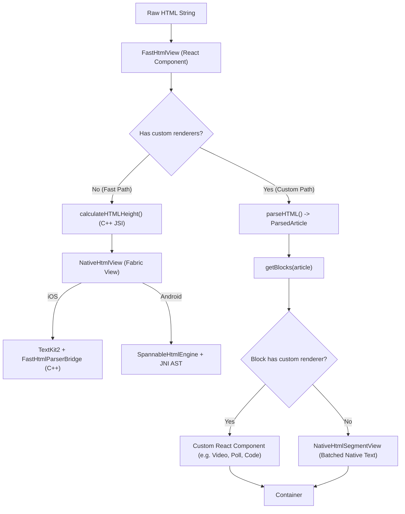
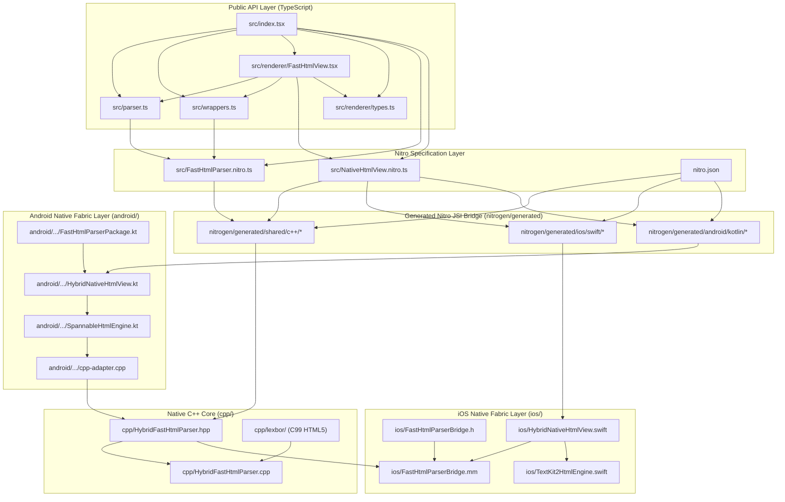
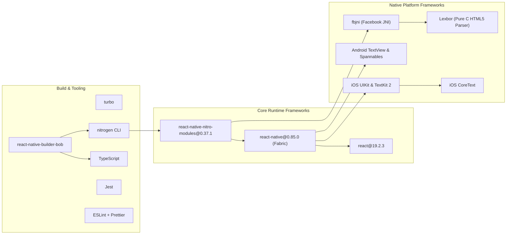
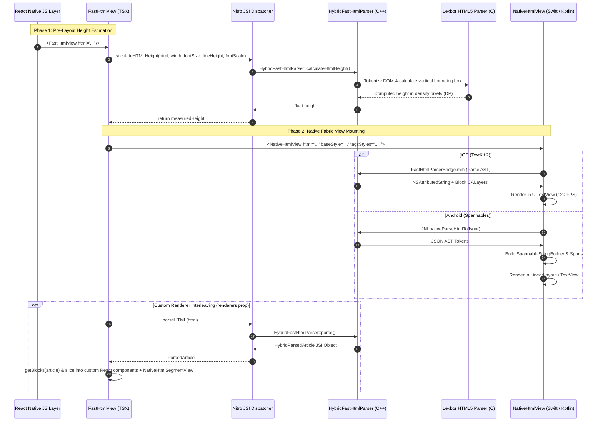

# Codebase Understanding Report: `react-native-nitro-html`

## 1. Project Overview & Architecture

`react-native-nitro-html` is an ultra-high performance HTML parser and 100% native Fabric RichText rendering engine for React Native (iOS & Android).

### Core Highlights:
- **Compiled C++ Parser (Lexbor HTML5)**: Parses raw HTML directly into a typed C++ Abstract Syntax Tree (AST) using the industrial-grade `lexbor` C library.
- **Direct JSI HostObjects (via Nitro Modules)**: Exposes the parsed AST directly to JavaScript as zero-copy JSI host objects (`HybridParsedArticle`, `HybridContentBlock`, `HybridInlineNode`, etc.) with lazy JSI traversal.
- **Dual-Path Rendering Engine**:
  1. **Fast Path (Default, 100% Native Fabric Layer)**: Renders the entire HTML document in a single native view (`UITextView` + TextKit 2 on iOS, `TextView` / `LinearLayout` + `SpannableStringBuilder` on Android) with synchronous C++ JSI height pre-calculation (`calculateHTMLHeight()`) for zero layout shift (CLS) at 120 FPS.
  2. **Custom Renderer Path (`renderers` prop)**: Traverses C++ AST blocks via `getBlocks()`, rendering custom React components for matched block types (e.g. `Video`, `CodeBlock`, `Table`, custom tags) and batching adjacent text into optimized native segment views (`NativeHtmlSegmentView`).
- **3-Tier Cascading Style System**: Enforces standard CSS specificity across C++, Swift, and Kotlin:
  - **Tier 1 (Base Style)**: Document-wide typography defaults via `baseStyle` prop.
  - **Tier 2 (Tags Styles)**: Semantic HTML tag overrides via `tagsStyles` prop.
  - **Tier 3 (Inline HTML Styles)**: Element-level `style="..."` attributes parsed directly from HTML.

---

## 2. Tech Stack

| Layer | Technologies & Dependencies |
| :--- | :--- |
| **Core Architecture** | React 19, React Native 0.85 (Fabric New Architecture), Nitro Modules (`react-native-nitro-modules` v0.37.1) |
| **Language & Tooling** | TypeScript 6, C++20, Swift 5.x, Kotlin (Java 17 / JVM Target), CMake, CocoaPods |
| **C++ Core Engine** | Lexbor HTML5 Parser (`cpp/lexbor`), JNI (`fbjni`), Nitrogen code generator |
| **iOS Engine** | TextKit 2, `NSTextLayoutManager`, `NSTextContentStorage`, `UITextView`, `CoreText`, `CALayer` |
| **Android Engine** | `SpannableStringBuilder`, `MetricAffectingSpan`, `LineBackgroundSpan`, `ReactFontManager` reflection |
| **Build & Packaging** | `react-native-builder-bob`, `turbo`, `yarn` (v4 berry) |
| **Linting & Testing** | Jest 29, ESLint 9 (Flat Config with Prettier) |

---

## 3. Folder & File Structure

```
react-native-fast-html-parser/
├── src/                                  # TypeScript Source & Public API
│   ├── index.tsx                         # Primary library export entry point
│   ├── parser.ts                         # Nitro HybridObject wrapper (parseHTML, calculateHTMLHeight, normalizeHTML)
│   ├── wrappers.ts                       # AST traversal helper functions (getBlocks, getChildren, etc.)
│   ├── FastHtmlParser.nitro.ts           # Nitro spec for C++ parser, AST blocks & inline nodes
│   ├── NativeHtmlView.nitro.ts           # Nitro spec for Fabric NativeHtmlView component
│   ├── renderer/
│   │   ├── FastHtmlView.tsx              # Main React component with Fast Path & Custom Renderer interleaving
│   │   └── types.ts                      # Props & component type definitions
│   └── __tests__/
│       └── index.test.tsx                # Comprehensive Jest test suite (35 tests)
├── cpp/                                  # C++ Engine & Parser Implementation
│   ├── HybridFastHtmlParser.hpp          # C++ header for HybridFastHtmlParser & AST node classes
│   ├── HybridFastHtmlParser.cpp          # Lexbor HTML parser, CSS style resolver, height estimator, JSON serializer
│   └── lexbor/                           # Vendored Lexbor HTML5 library
├── ios/                                  # iOS Native Fabric & TextKit 2 Engine
│   ├── FastHtmlParserBridge.h/.mm        # Obj-C++/C++ bridge for Lexbor AST -> NSAttributedString conversion
│   ├── HybridNativeHtmlView.swift        # Nitro Fabric UIView implementation (UITextView + TextKit 2)
│   └── TextKit2HtmlEngine.swift          # TextKit 2 attributed string builder
├── android/                              # Android Native Engine & JNI Bridge
│   ├── CMakeLists.txt                    # CMake build configuration linking Lexbor & fbjni
│   └── src/main/
│       ├── cpp/cpp-adapter.cpp           # JNI bindings for Android Spannable bridge
│       └── java/.../fasthtmlparser/
│           ├── FastHtmlParserPackage.kt  # React Native package registering NativeHtmlView
│           ├── HybridNativeHtmlView.kt   # Nitro Fabric View implementation (LinearLayout/TextView)
│           └── SpannableHtmlEngine.kt    # Android SpannableStringBuilder engine & custom Spans
├── nitrogen/                             # Auto-generated Nitrogen JSI bindings & specs
│   └── generated/                        # Autolinked bridging code for C++, Swift, and Kotlin
├── example/                              # Showcase & Performance Benchmark App
│   └── src/App.tsx                       # Full interactive demo with 4 tabs (FastHtmlView, Scale, Wrappers, JSON)
├── nitro.json                            # Nitro Module configuration
├── package.json                          # Package scripts, dependencies, build targets
└── tsconfig.json                         # TypeScript configuration
```

---

## 4. Architecture & Data Flow



### Key Execution Lifecycle:
1. **Synchronous JSI Height Calculation**: `calculateHTMLHeight()` runs in C++ to compute the exact bounding box before initial layout, preventing Frame 0 visual jumps.
2. **Native TextKit 2 (iOS)**: `FastHtmlParserBridge.mm` converts parsed AST blocks into `NSAttributedString` with custom `CALayer` decorations for block backgrounds, quotes, borders, and image view attachments.
3. **Native Spannable Engine (Android)**: `SpannableHtmlEngine.kt` generates Android `SpannableStringBuilder` with custom spans (`BlockBackgroundSpan`, `CustomTypefaceSpan`, `FontFeatureSpan`).
4. **Dynamic Font Resolution**: Dynamically queries bundled/system fonts via `ReactFontManager` (Android) and `UIFontDescriptor` (iOS) with fallbacks for generic CSS families (`monospace`, `serif`, `sans-serif`).

---

## 5. Coding Standards & Conventions

1. **Nitro Specifications First**: Declare shared C++, Swift, and Kotlin interfaces in `*.nitro.ts` files ([FastHtmlParser.nitro.ts](file:///Users/abhishekhprajapati/Projects/react-native-fast-html-parser/src/FastHtmlParser.nitro.ts), [NativeHtmlView.nitro.ts](file:///Users/abhishekhprajapati/Projects/react-native-fast-html-parser/src/NativeHtmlView.nitro.ts)) using `HybridObject` and `HybridView`.
2. **Allocation-Conscious JavaScript**: Avoid heap allocations in hot paths (e.g. `hasCustomRenderers` uses `for..in` instead of `Object.keys()`, frozen empty object constants `EMPTY_STYLE`).
3. **Platform Equivalency**: Any feature, tag, or style handled on iOS ([FastHtmlParserBridge.mm](file:///Users/abhishekhprajapati/Projects/react-native-fast-html-parser/ios/FastHtmlParserBridge.mm)) must have identical functional parity on Android ([SpannableHtmlEngine.kt](file:///Users/abhishekhprajapati/Projects/react-native-fast-html-parser/android/src/main/java/com/margelo/nitro/fasthtmlparser/SpannableHtmlEngine.kt)).
4. **LRU / Thread-Safe Caching**: Native bridges implement caching on color conversions and font resolutions (`sColorCache`, `sFontCache` on iOS, `typefaceCache`, `colorCache` on Android).

---

## 6. Important Reusable Patterns & Abstractions

- **AST Wrappers ([src/wrappers.ts](file:///Users/abhishekhprajapati/Projects/react-native-fast-html-parser/src/wrappers.ts))**:
  - `getBlocks(article)`: Converts native `ParsedArticle` block collection into a JavaScript array.
  - `getChildren(node)`: Traverses child `InlineNode` elements.
  - `getItems(block)` / `getNestedBlocks(item)`: Traverses ordered and unordered list items.
  - `getRows(block)` / `getCells(row)`: Traverses 2D table grid structures.
  - `getQuoteChildren(block)` / `getDefItems(block)`: Traverses blockquotes and definition lists.
- **Custom Block Renderers**:
  - `renderers` prop accepts custom React components keyed by block name (e.g. `Heading`, `Paragraph`, `Quote`, `CodeBlock`, `List`, `Table`, `DefinitionList`, `Image`, `Figure`, `Video`, `Audio`, `Separator`, `Embed`, or any custom web component tag like `custom-poll`).

---

## 7. Key Dependencies

- **`react-native-nitro-modules`**: Core JSI interop framework generating C++ / Swift / Kotlin bridging code.
- **`lexbor`**: Pure C HTML5 tokenizer and DOM parser included in `cpp/lexbor`.
- **`react-native-builder-bob`**: Build pipeline for emitting ESM modules, TypeScript declarations, and triggering `nitrogen`.

---

## 8. Important Constraints & Rules for Modifying

1. **Spec Sync Invariant**: Any modification to methods/properties in `src/*.nitro.ts` requires running `yarn nitrogen` to regenerate the C++, Swift, and Kotlin interface headers in `nitrogen/generated/`.
2. **Never edit `nitrogen/generated/` manually**: All code in `nitrogen/generated/` is auto-generated.
3. **Maintain 3-Platform Parity**: Any changes to HTML tag support, styling, or AST properties must be implemented synchronously across:
   - C++ Core (`cpp/HybridFastHtmlParser.cpp`)
   - iOS TextKit 2 (`ios/FastHtmlParserBridge.mm` & `ios/HybridNativeHtmlView.swift`)
   - Android Spannable Engine (`android/.../SpannableHtmlEngine.kt` & `HybridNativeHtmlView.kt`)
4. **Zero Layout Shift Invariant**: Height estimations in C++ (`calculateHtmlHeight`) must stay deterministic and match actual native font rendering.
5. **Validation Suite**: Always verify changes by running `yarn typecheck`, `yarn test`, and `yarn lint`.

---

## 9. Dependency Knowledge Graph

### 9.1 Module & Source File Dependency Graph



---

### 9.2 Third-Party & Ecosystem Dependency Hierarchy



---

### 9.3 Cross-Boundary JSI Call & Data Resolution Flow


